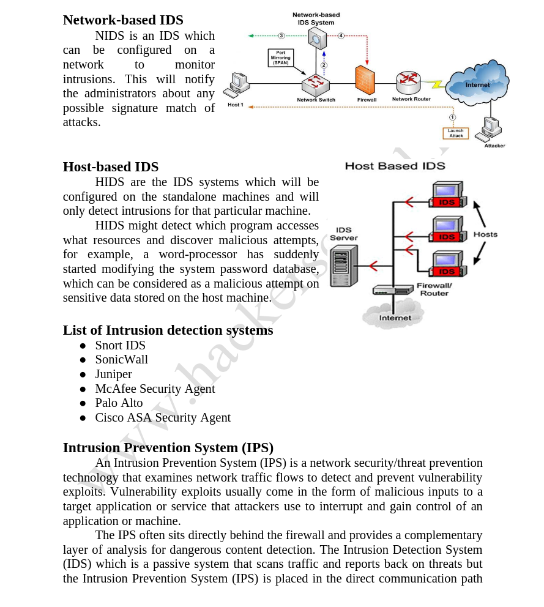
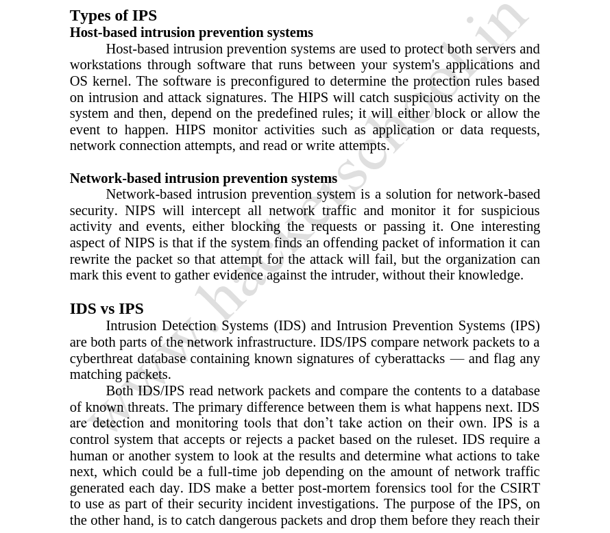
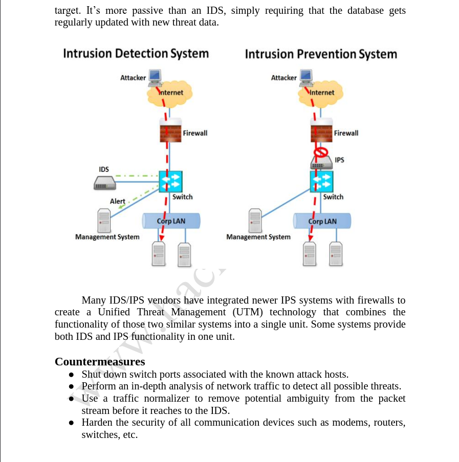
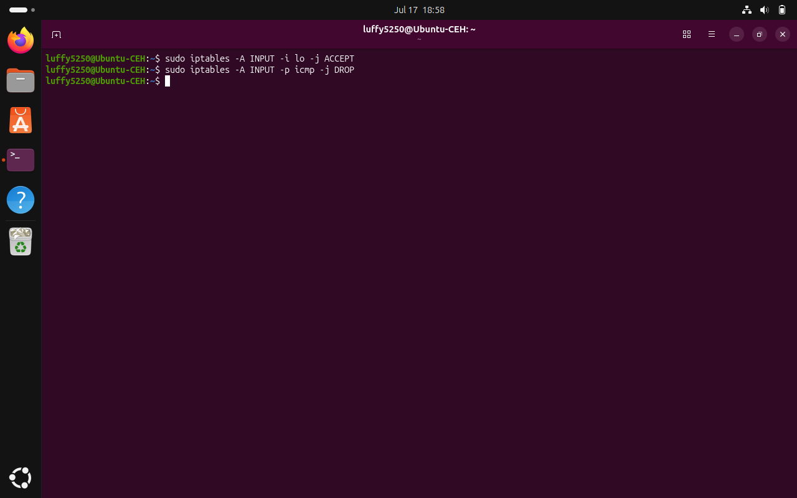
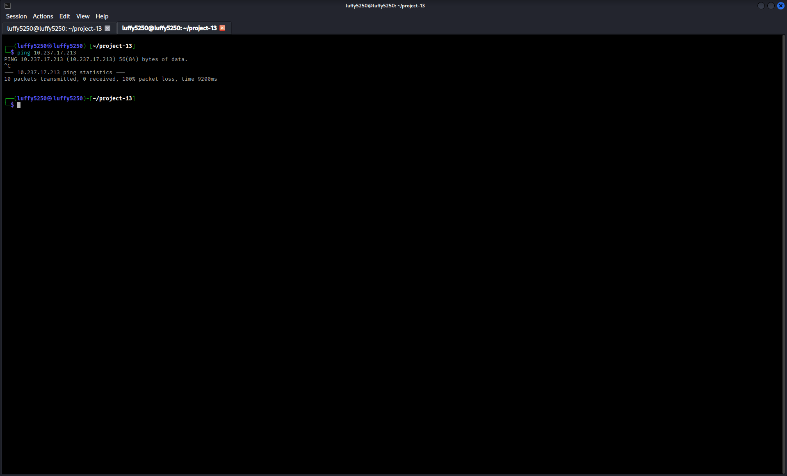
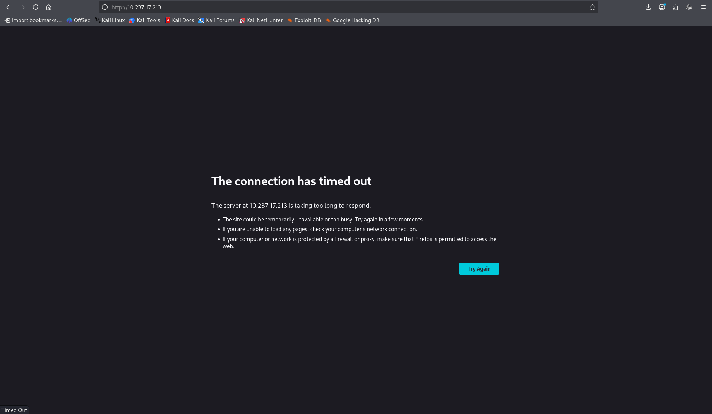
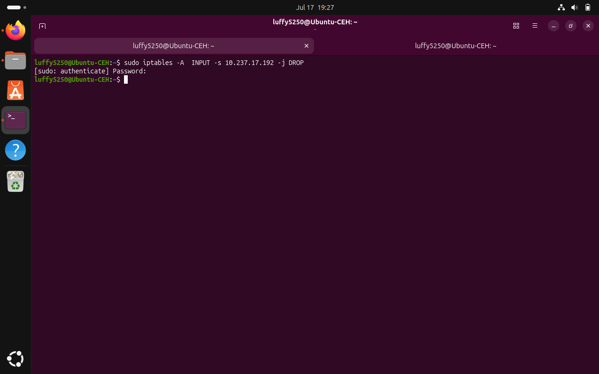
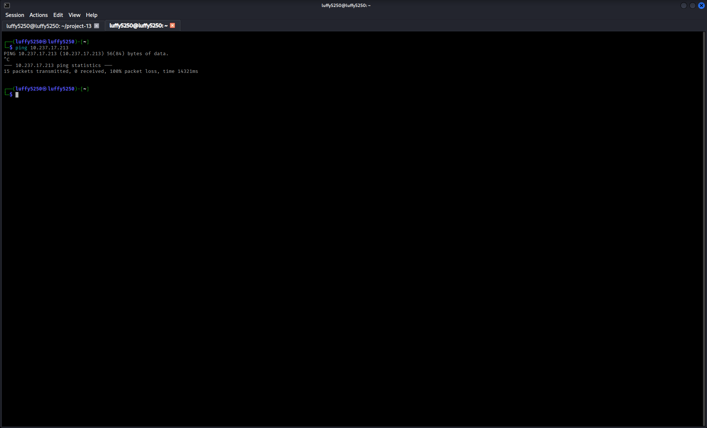
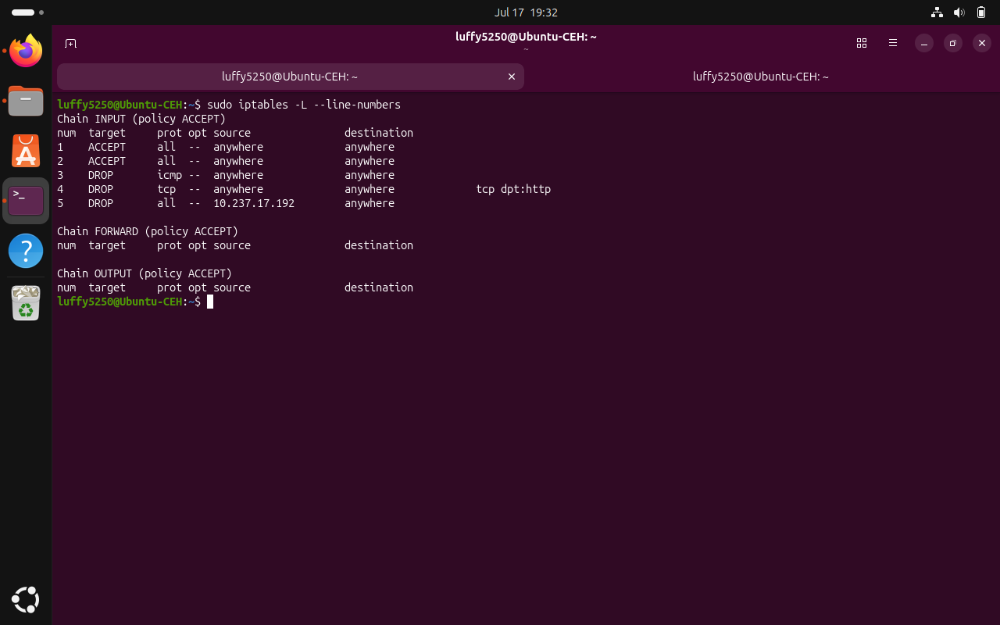
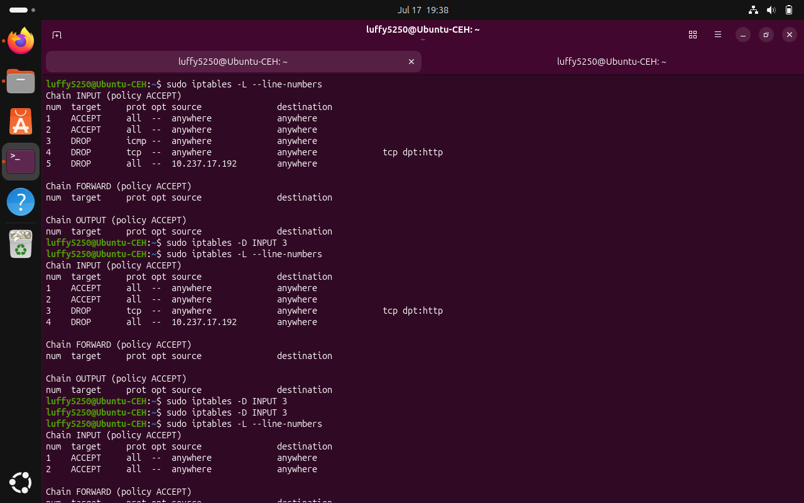

# Project 13 – Evading IDS, Firewalls and Honeypots

# Part 1 – Understanding IDS, Firewalls and Honeypots

## Objective

The main goal of this project is to learn about security devices like Intrusion Detection Systems, Firewalls and Honeypots. These devices help protect computer networks from cyber attacks. This project also talks about ways to evade th>

> **Note:** This project is for educational purposes and should only be done in a controlled laboratory environment.

---

# What is an Intrusion Detection System (IDS)?

An Intrusion Detection System is a security solution that watches network traffic or host activities for behavior. It looks for things that are not allowed by the rules or for known attack signatures.

Unlike a firewall an Intrusion Detection System does not block traffic. Instead it sends alerts to security analysts so they can look into threats.



**IDS, Firewall and Honeypot Overview**

```text
ids-firewall-honeypot-overview.png
```


### Types of IDS

### Network-based IDS

- It monitors network traffic.

- It detects suspicious packets.

- It protects multiple devices.

**Examples**

- Snort

- Suricata

- Zeek

---

### Host-based IDS

- It is installed on computers.

- It monitors files, processes, logs and system activity.

- It detects changes.

**Examples**

- OSSEC

- Wazuh

---

# What is an Intrusion Prevention System (IPS)?

An Intrusion Prevention System is like an Intrusion Detection System. It also blocks or prevents malicious traffic from reaching the target system.

Unlike an Intrusion Detection System, an Intrusion Prevention System works inline with network traffic. Can stop attacks.

---

# IDS vs IPS

| Feature | IDS IPS |


| Detects Attacks | Yes | Yes |

| Blocks Attacks | No | Yes |

| Generates Alerts | Yes | Yes |

| Inline Protection | No | Yes |






**IDS vs IPS Comparison**

```text
ids-vs-ips-comparison.png
```


---

# What is a Firewall?

A Firewall is a network security device or software that controls outgoing network traffic based on predefined rules.

Firewalls are the line of defense. They allow traffic and block bad traffic.

### Common Firewall Types

- Packet Filtering Firewall

- Stateful Inspection Firewall

- Proxy Firewall

- Next-Generation Firewall (NGFW)

---

# What is a Honeypot?

A Honeypot is a system that is set up to attract attackers. It is like a decoy.

Its purpose is to watch what attackers do gather information and learn about attack techniques without putting real systems at risk.

### Benefits

- It helps detect attackers

- It gathers threat information.

- It helps study attacker techniques.

- It improves incident response.

---

# What is a Honeynet?

A Honeynet is a group of Honeypots connected together. It simulates a network environment for security research and monitoring.

---
# Why Do Attackers Try to Evade Security Devices?

Attackers try to avoid being detected so they can:

- Remain hidden

- Bypass security controls

- Keep accessing systems without permission

- Steal sensitive information

- Keep attacking without triggering alerts

---

# Defensive Security Measures

To reduce the risk of evasion organizations do the following:

- They use Layered security

- They keep Intrusion Detection System and Intrusion Prevention System signatures up to date

- They use secure firewall rules

- They segment the network

- They use threat intelligence

- They monitor everything all the time

- They use Security Information and Event Management

- They do regular security audits

---

# SOC Analyst Perspective

SOC analysts watch Intrusion Detection System, Intrusion Prevention System, firewall logs and network events all the time. They look for behavior. They investigate alerts look at events across systems and respond to incidents before th>

SOC analysts do the following:

- They review Intrusion Detection System alerts

- They monitor firewall logs

- They investigate network traffic

- They identify Indicators of Compromise

- They escalate confirmed incidents

---
# Key Concepts Learned

- Intrusion Detection System

- Intrusion Prevention System

- Network-based IDS

- Host-based IDS

- Firewalls

- Honeypots

- Honeynets

- Defense in Depth

- Threat Detection

- SOC Monitoring

---

# conclusion

Understanding Intrusion Detection Systems, Intrusion Prevention Systems, Firewalls and Honeypots is very important, for cybersecurity professionals. These technologies help detect, prevent and analyze cyber threats.
Knowing how these security devices work helps SOC analysts find activity improve network security and respond to security incidents.

-------------------------------------------------------------------------------------------------------------------------------------------------------------------------------------------------------------------------------


# Project 13 – Evading IDS, Firewalls and Honeypots

# Part 2 – Configuring Firewall Rules Using iptables on Ubuntu

## Objective

The goal of this project is to learn how to configure and manage firewall rules using **iptables** on an Ubuntu Linux system. We will see how to block ICMP requests restrict access to ports, block traffic from specific IP addresses list firewall rules and delete firewall rules in a controlled laboratory environment. This project will help us understand how **iptables** works on Ubuntu.

> **Note:** This project was done in a virtual laboratory environment for educational purposes only.

---

# Lab Environment

| Machine | Role |


| Ubuntu Linux |Protected Target Machine |

| Kali Linux | Attacker / Testing Machine |

| VirtualBox | Virtualization Platform |

| iptables | Linux Firewall |

---

# Verifying Network Connectivity

First we need to make sure that both virtual machines can communicate with each other. On the **Ubuntu** machine we need to find the IP address. We can do this by using the following commands:

```bash

ip addr show

```

or

```bash

hostname -I

```

from the **Kali Linux** machine we can verify connectivity by pinging the **Ubuntu** machine.

```bash

ping <Ubuntu_IP_Address>

```

If we get a reply it means that both systems are connected before we apply any firewall rules.

---

# Blocking ICMP Requests

To allow ICMP traffic from the loopback interface we use the following command:

```bash

sudo iptables -A INPUT -i lo -j ACCEPT

```

Then to block ICMP requests from external systems we use:

```bash

sudo iptables -A INPUT -p icmp -j DROP

```

After applying these rules we can try to ping the **Ubuntu** machine from **Kali Linux** again.

```bash

ping <Ubuntu_IP_Address>

```

This time the firewall should block the ICMP requests and the **Ubuntu** system will not respond.





**Blocking ICMP Requests**

```text

block-icmp-iptables.png

```

---

# Blocking Access to TCP Port 80

If the Apache Web Server is not installed on **Ubuntu** we need to install it.

```bash

sudo apt update

sudo apt install apache2

```

Then we start the Apache service.

```bash

sudo systemctl start apache2

```

We can verify the service status by using:

```bash

sudo systemctl status apache2

```

To block HTTP traffic we use the following command:

```bash

sudo iptables -A INPUT -p tcp --dport 80 -j DROP

```

Now if we try to open the **Ubuntu** web server from **Kali Linux** it should fail to connect because the firewall blocks TCP port 80.

```

http://<Ubuntu_IP_Address>

```



**Blocking TCP Port 80**

```text

block-port-80-iptables.png

```

---

# Blocking an IP Address

To block all traffic from the **Kali Linux** machine we use the following command:

```bash

sudo iptables -A INPUT -s <Kali_IP_Address> -j DROP

```

For example:

```bash

sudo iptables -A INPUT -s 192.168.0.123 -j DROP

```

After applying this rule **Kali Linux** should no longer be able to communicate with **Ubuntu**.






**Blocking an IP Address**

```text

block-ip-address-iptables.png

```

---

# Listing Firewall Rules

To display all configured firewall rules we use the following command:

```bash

sudo iptables -L --line-numbers

```

The output will show every firewall rule along with its rule number.



**Listing Firewall Rules**

```text

list-iptables-rules.png

```

---

# Deleting Firewall Rules

To delete a firewall rule we use the following command:

```bash

sudo iptables -D INPUT <Rule_Number>

```

For example:

```bash

sudo iptables -D INPUT 3

```

We can verify that the rule has been removed by listing the firewall rules

```bash

sudo iptables -L --line-numbers

```



**Deleting Firewall Rules**

```text

delete-iptables-rule.png

```

---

# Observation

During this project we saw that **Ubuntu** accepted firewall rules using **iptables**. We blocked ICMP requests from **Kali Linux** denied HTTP access to the **Ubuntu** web server applied IP-based access restrictions, listed firewall rules and removed firewall rules using their rule numbers.

---

# SOC Analyst Perspective

Firewalls are a key security control that helps restrict unauthorized network access. SOC analysts review firewall logs to identify blocked connections, suspicious source IP addresses, unusual traffic patterns and policy violations. Proper firewall configuration helps reduce the attack surface and protects systems from unauthorized access.

---

# Key Concepts Learned

- Linux Firewall

- iptables

- ICMP Filtering

- Port Filtering

- IP Address Blocking

- Firewall Rule Management

- Network Security

- Access Control

---

#  conclusion

In this project we. Managed firewall rules using **iptables** on an **Ubuntu Linux** system. We learned how to control network traffic by blocking ICMP requests restricting ports,
filtering traffic, from specific IP addresses reviewing configured firewall rules and removing firewall rules when no longer required. 
This project helped us understand how to use **iptables** to secure our network and protect our systems from access.
